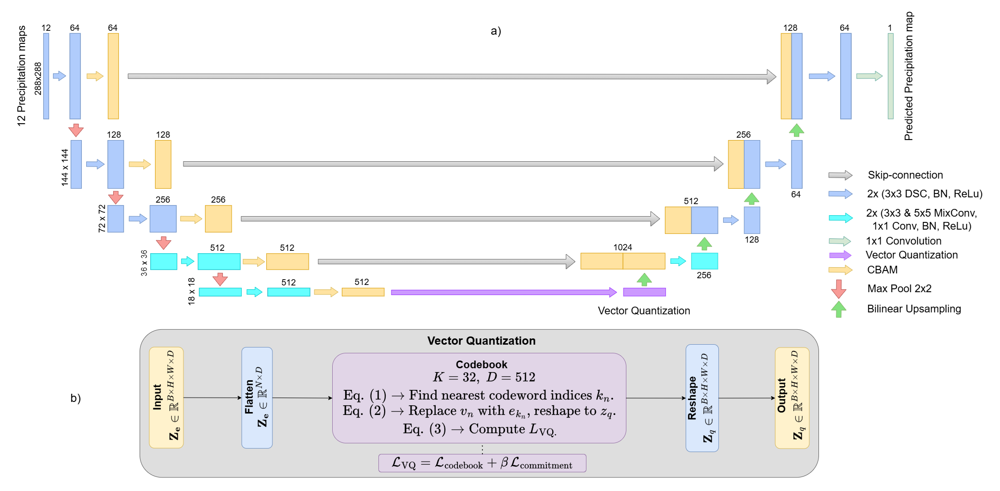
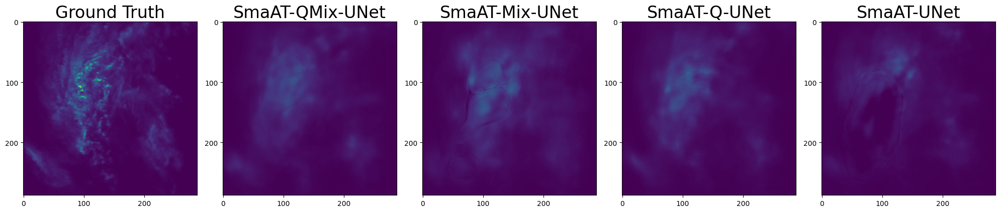

# SmaAT-QMix-UNet

Code for the paper "SmaAT-QMix-UNet: A Parameter-Efficient Vector-Quantized UNet for Precipitation Nowcasting"

# Datasets & Models
If you want access to the dataset used in this paper, please visit https://github.com/HansBambel/SmaAt-UNet for further details.
You can also contact s.mehrkanoon@uu.nl. 
Please put the dataset into "\data\precipitation" directory for training and testing.

To create the NL-50 dataset, use create_datasets.py file

# Training
For training on the precipitation task we used the train_precip_lightning.py file.
Training was done using Pytorch-Lightning.
The modules and libraries needed can be seen at Guides/SLURM-Help.txt and pyproject.toml

# Testing

In order to compute all the metrics for your model you first need to move the model checkpoint to lightning/precip_regression/comparison. Once Then use calc_metrics_test_set.py to compute the metrics.

# Ground Truth and Output prediction examples

To view examples of output from a trained model, use the plot_examples_specific.ipynb or plot_examples_top_k.ipynb files

# Explainability
The XAI plots for gradcam can be obtained from running gradcamfull_updated.ipynb and the UMAP from running UMAP.ipynb

# Citation

If you use our data and code, please cite the paper using the following bibtex reference:
